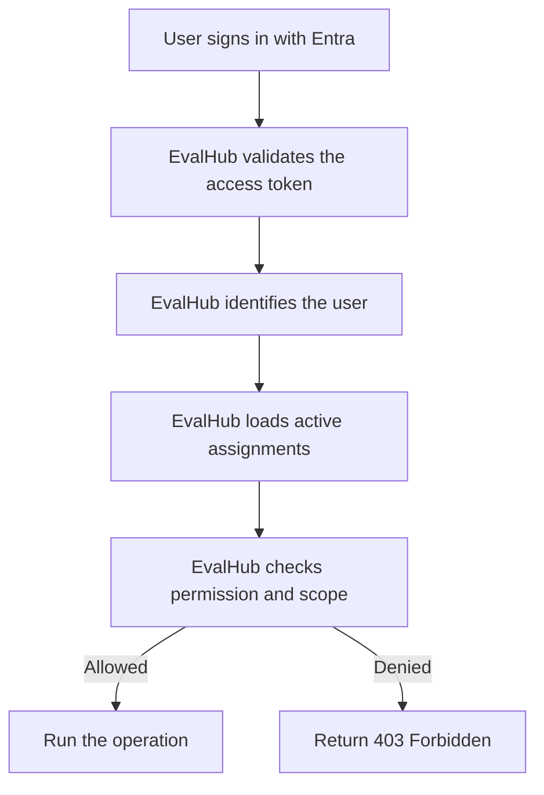
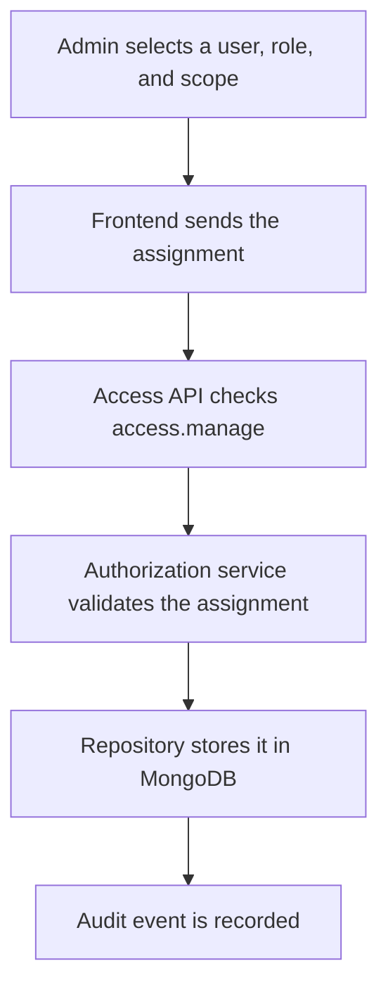
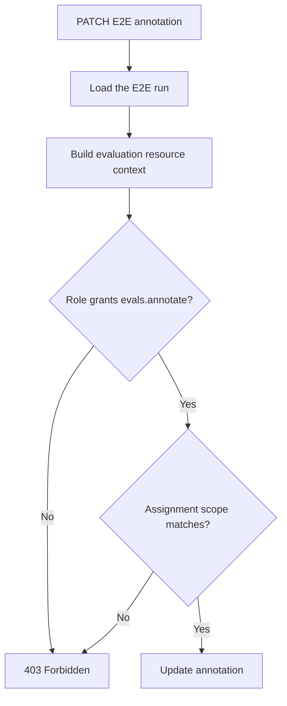

# Authentication and authorization

This document explains how EvalHub identifies users and decides what they are allowed to do.

## The main rule

- **Microsoft Entra identifies the user.**
- **EvalHub decides what the user can do.**

Entra app roles such as `EvalHub.Admin` and `EvalHub.Editor` are not required. Roles, permissions, and scopes are stored and enforced by EvalHub.

## Authentication versus authorization

| Question | Owner | Example |
|---|---|---|
| Who is making the request? | Microsoft Entra | “This is user `bob-id` in tenant `tenant-1`.” |
| Is the access token valid? | Microsoft Entra integration in EvalHub | Validate signature, issuer, audience, tenant, client application, and API scope. |
| What may the user do? | EvalHub | Bob may annotate evaluations. |
| Which evaluations may the user change? | EvalHub | Bob may annotate only E2E evaluations in the Platform category. |



## Roles and permissions

A **role** is a reusable group of permissions. A **permission** describes an action.

| Role | Permissions |
|---|---|
| `editor` | `evals.annotate`, `evals.edit` |
| `admin` | All editor permissions plus `suggestions.moderate`, `access.manage`, and `audit.read` |

The role-permission mapping answers: **“Can this role perform this action?”**

For example, an editor role contains `evals.annotate`, so an editor can potentially annotate an evaluation. The assignment scope still decides which evaluation the editor can annotate.

## Assignments and scopes

An **assignment** connects a user to:

1. a role; and
2. a scope.

The scope limits where the role applies.

Examples:

| Assignment | Result |
|---|---|
| Editor + all evaluations | Can annotate and edit unit and E2E evaluations. |
| Editor + `eval_type=e2e` | Can annotate and edit only E2E evaluations. |
| Editor + `eval_type=unit`, `category=platform` | Can annotate and edit only Platform unit evaluations. |
| Admin + global scope | Can manage access, audit records, suggestions, and evaluations. |

An example fine-grained assignment stored by EvalHub:

```json
{
  "tenant_id": "tenant-1",
  "principal_id": "bob-id",
  "local_role": "editor",
  "scope": {
    "type": "resource",
    "resource": "evaluation",
    "constraints": {
      "eval_type": ["e2e"],
      "category": ["platform"]
    }
  },
  "reason": "Maintains Platform E2E evaluations"
}
```

This assignment means Bob receives the editor permissions, but only for E2E evaluations whose category is `platform`.

### Scope matching rules

- Values inside one constraint are alternatives. For example, `eval_type=[unit, e2e]` allows either type.
- Different constraints must all match. For example, `eval_type=e2e` and `category=platform` requires both.
- A missing constraint means that dimension is unrestricted.
- If an assignment requires an attribute that the resource does not provide, access is denied.
- If a user has several assignments, any active assignment that grants the permission and matches the resource is enough.

Category and subgroup constraints can be added later without changing the overall design. Until those attributes exist, use an evaluation-type scope or an all-evaluations scope.

## Assigning access

Only a user with `access.manage` can create or revoke assignments.



Users normally appear in access management after their first successful sign-in, because that gives EvalHub a trusted Entra identity to assign.

## Validating an E2E annotation

Suppose Bob tries to annotate an E2E run.

1. EvalHub authenticates Bob from the Entra token.
2. The dependency loads the E2E run.
3. It builds a resource context from the real run data.
4. The authorization service checks for `evals.annotate`.
5. It verifies that at least one active assignment scope matches the run.
6. The route runs only when both checks pass.



The route should use one reusable, typed FastAPI dependency:

```python
@router.patch("/runs/{run_id}/annotation")
async def annotate_e2e_run(
    payload: E2EAnnotationUpdate,
    run: CanAnnotateE2ERun,
    repository: E2ERepositoryDependency,
) -> E2ERun:
    return await repository.update_annotation(run.id, payload)
```

`CanAnnotateE2ERun` performs the standard work:

- get the authenticated user;
- load the run by `run_id`;
- build an evaluation resource context such as `eval_type=e2e`;
- require `evals.annotate` for that context; and
- return the already-loaded run, or return `403` when access is denied.

This keeps route handlers small and prevents each endpoint from implementing authorization differently.

## Backend module responsibilities

| Module | Responsibility |
|---|---|
| `src/security/auth.py` | Validate Entra tokens and create the authenticated identity. It does not assign application roles. |
| `src/security/permissions.py` | Define permissions, local roles, and the role-permission mapping. |
| `src/models/authorization.py` | Define assignments, scopes, and resource-context models. |
| `src/security/resources.py` | Build resource contexts from real domain objects. |
| `src/services/authorization.py` | Load assignments and check permission plus scope. |
| `src/repositories/authorization.py` | Read and write authorization data in MongoDB. |
| `src/security/*_dependencies.py` | Provide reusable endpoint checks such as `CanAnnotateE2ERun`. |
| Access administration routes | Create, revoke, list, and audit assignments. |

## Rules for new endpoints

For every protected operation:

1. Choose the action permission, such as `evals.annotate` or `evals.edit`.
2. Load the real resource before checking its scope.
3. Build the resource context from trusted backend data, not request-supplied category or type values.
4. Use a reusable typed dependency for the check.
5. Deny by default when the assignment, permission, scope, or required resource attribute is missing.

Read-only endpoints may remain public if that is an explicit product decision. Every mutation should have an explicit authorization dependency.
